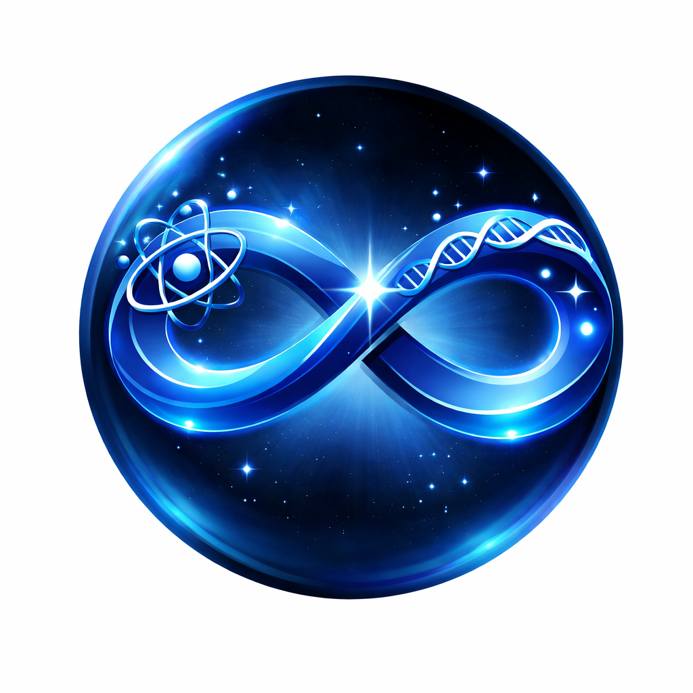

  

Phase 1: Foundation (地基阶段)
[x] 建立 GitHub 仓库与网页托管 (Done!)

[ ] 集成 LaTeX 数学公式渲染引擎 (让公式变漂亮)

[ ] 确定第一版视觉风格（配色、字体）

Phase 2: Mathematics Intuition (数学直觉)
[ ] Linear Algebra: 空间的拉伸与变换动画

[ ] Calculus: 导数到底在描述什么的互动滑块

Phase 3: Physics & Beyond (物理与跨学科)
[ ] Mechanics: 模拟一个真实的重力世界

[ ] Chemistry: 电子云的动态概率模型
